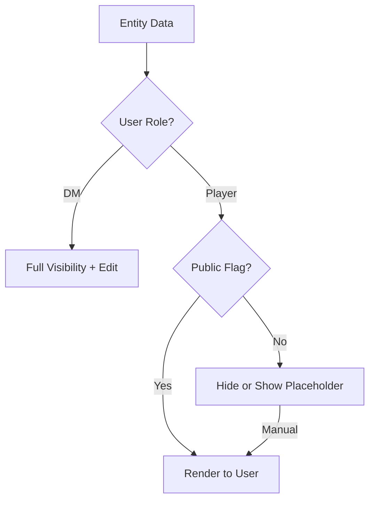

# Player vs. DM Modes

TTRPG.Codex supports two primary user roles: **Dungeon Master (DM)** and **Player**. The system uses role-based access to determine what data is displayed and which actions are available.

## Visibility Logic

The core concept is the **Public/Private Toggle**. Every entity (NPC, Item, Location, Event) has a visibility flag.

## DM Mode (The Architect)
The DM is the world-builder. Their interface includes:
- **Campaign Dashboard**: Full overview of all active modules.
- **Hidden Entities**: NPCs not yet met, secret artifacts, and impending encounters.
- **Timeline Control**: The ability to add "Future" events or "Hidden" historical lore.
*   **Encounter Manager**: Full stat-blocks and tactical overview.

## Player Mode (The Adventurer)
Players experience the world through their characters.
- **Public Grimoire**: Lore discovered by the party.
- **Character Dashboard**: 
  - Manage stats and bio.
  - **Session Notes**: Append-only notepad linked to specific sessions.
  - **Shared Visibility**: Notes toggled to "Public" are viewable by all party members; otherwise, they are private to the creator and DM.
  - **DM Shares**: Specific notes or insights shared by the DM with that player.

## NPC Visibility States
NPCs use a tiered visibility system to maintain immersion:
1. **Hidden**: Players have never encountered the NPC. They are completely omitted from the player's Codex.
2. **Unknown**: Players have seen the NPC but do not know their identity. They appear as "Unknown NPC" with a generic placeholder icon/description.
3. **Known (Revealed)**: The DM has revealed their identity. Full name, race, and public bio are rendered.

## Interaction Table

| Feature | DM Permission | Player Permission |
| :--- | :--- | :--- |
| **NPCs** | Create, Edit, Toggle Public | View (if Public) |
| **Encounters** | Full Access | No Access (until triggered) |
| **Locations** | Full Map/Details | Public Locations only |
| **Timeline** | All Events | History + Public Milestones |
| **Sessions** | Create Recap, Log Events | View Recap, Add Personal Notes |
